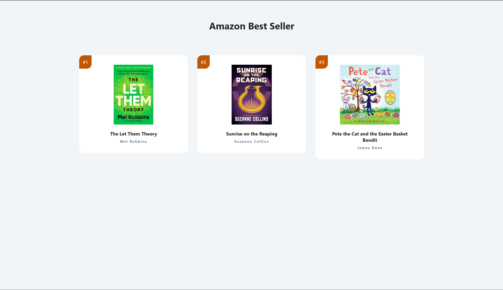

# 📚 Amazon Best Sellers – Book List App

This is a simple React app that displays a list of best-selling books on Amazon. It shows book images, titles, authors, and order numbers using reusable components and props.

## 🚀 Features

- Displays a list of books with:
  - Image
  - Title
  - Author
  - Book number
- Uses React components and props
- Organized structure with separate files for data and components

## 📂 Project Structure

```
├── public/
├── src/
│   ├── images/
│   │   ├── book.jpg
│   │   ├── book-1.jpg
│   │   └── book-2.jpg
│   ├── Book.js         # Book component
│   ├── books.js        # Book data
│   ├── index.js        # Entry point
│   └── index.css       # Styles (optional)
├── package.json
└── README.md
```

## 🧩 Components

### `Book.js`
A functional component that receives props (image, title, author, number) and displays book info.

### `books.js`
Exports an array of book objects with `title`, `author`, `img`, and `id`.

### `index.js`
Main file that renders the `BookList` component and maps over the books array.

## 📦 Getting Started

1. Clone the repo:
   ```bash
   git clone https://github.com/Snapix07/Book-Cards.git
   ```

2. Navigate into the folder:
   ```bash
   cd your-repo
   ```

3. Install dependencies:
   ```bash
   npm install
   ```

4. Start the development server:
   ```bash
   npm start
   ```

5. Open your browser and go to:
   ```
   http://localhost:3000
   ```

## 🛠️ Technologies Used

- React
- JavaScript (ES6+)
- CSS Modules or plain CSS
- JSX

## ✨ Preview



## 📄 License

This project is open source and available


> Created as a simple demo project to practice React components and props.
